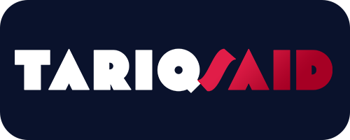
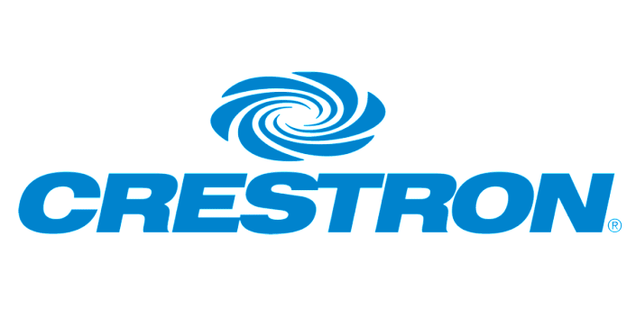
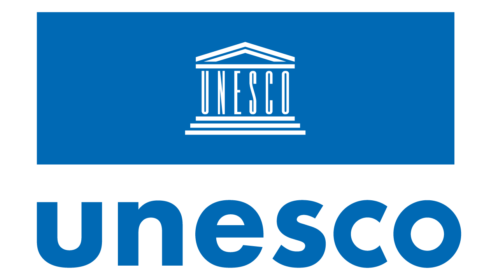
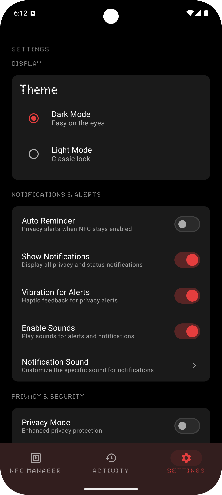
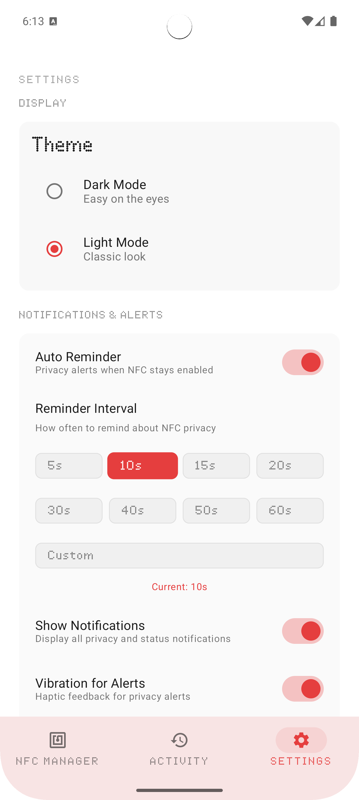
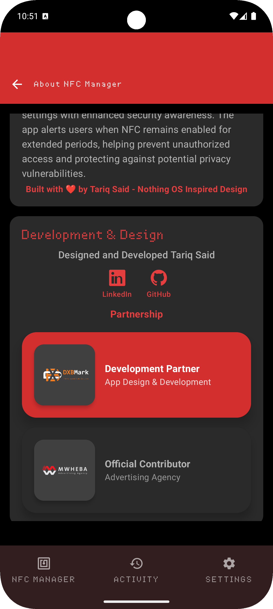
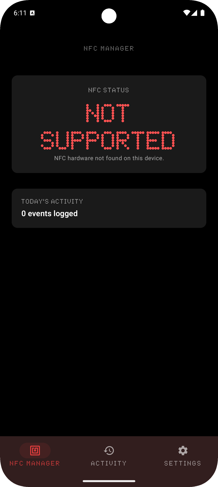
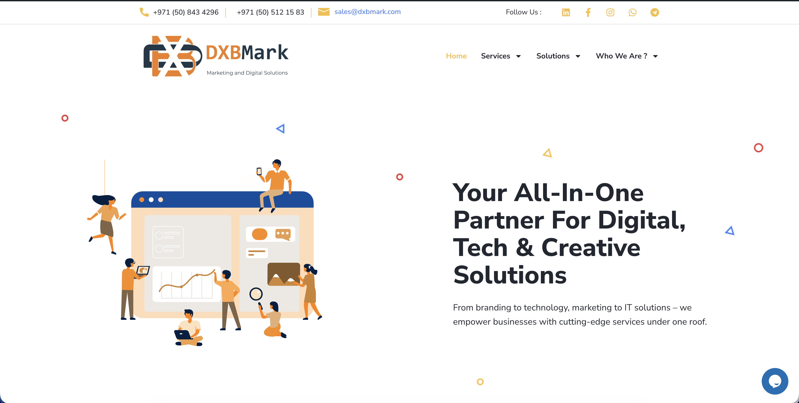
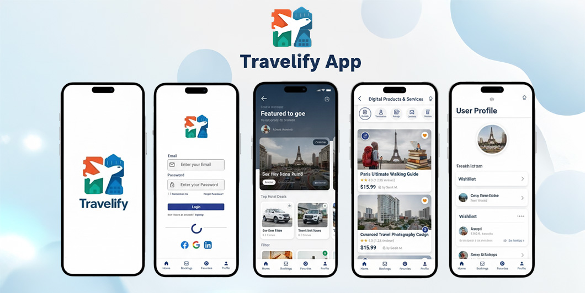

<!-- Typing Multi-Language Greeting -->

# I'm **Tariq Said**
### **Full-Stack Developer • AV/IT Integration Specialist**

  
  

  
   

---

## About Me

I build **human-centred digital systems** that bridge **software development**, **audio-visual integration**, and **event technology**.  
With 15+ years of experience in **IT infrastructure, AV systems**, and **full-stack web development**,  
I deliver seamless, scalable solutions combining **engineering, creativity, and reliability**.

  
**Honorary Partner** [MWHEBA Advertising](https://www.mwheba.com/) & [MWHEBA Hosting](https://mwheba.net/)

---

## Certifications & Credentials

| Logo | Certification | Issuer | Status |
|:--:|---|---|---|
|  | **AI Prompt Engineering (1 Million Prompters)** | Dubai Future Foundation | ✅ Active |
|  | **Certified Audio Technician** | Crestron Electronics | ✅ Active |
|  | **Certified Microsoft Innovative Educator** | Microsoft | ✅ Active |
|  | **Assistive Technologies** | Microsoft | ✅ Active |
|  | **ICDL Syllabus v4.0** | UNESCO | ✅ Active |
|  | **AV Associate Certification** | Extron Electronics | ✅ Active |
|  | **Effective Presentations** | HP LIFE | ✅ Active |
|  | **License to Practice an IT Profession** | Ministry of Manpower – Egypt | ✅ Active |
|  | **Certified Digital Citizen** | CompuTony.com  <i>(Accredited by Jouly Academy UK)</i> | ✅ Active |
|  | **Next Danger (Metaverse / Web3) – 3rd Generation Internet** | CompuTony.com  <i>(Accredited by Jouly Academy UK)</i> | ✅ Active |

---
## Tech Stack & Tools

### Core Stack

---

### Frontend & Mobile

---

### Databases & Storage

---

### DevOps & Infrastructure

---

### AI, Automation & APIs

---

### AV, Systems & Integration

---

## Current Focus

- Building scalable Django, FastAPI and React systems.
- Designing AI-assisted tools for automation, search and workflow support.
- Integrating AV, IT infrastructure and event technology into reliable digital systems.
- Improving deployment pipelines using Docker, GitHub Actions and cloud infrastructure.

---

## Professional Projects

### [NFC Manager](https://github.com/tariqsaidofficial/nfcManager)
Android app for managing NFC tags securely, inspired by Nothing OS.

  
  
  
  

---

### [DXBMark](https://dxbmark.com)
Official company website and a suite of web tools at [tools.dxbmark.com](https://tools.dxbmark.com) delivering online utilities.  
📊 **Impact:** 3K+ users | 98.7% uptime

---

### [Media Server-as-a-Service](https://media.dxbmark.com)
Scalable streaming platform for hosting and serving media content, akin to a self-hosted Netflix.  
📊 **Impact:** 500+ concurrent streams | 99.2% uptime

---

### [Northern Estates](https://northernestates.ae)
Co-founder and developer of a leading real-estate platform in Dubai, UAE.  
📊 **Impact:** 10K+ active users | 500+ properties | 99.1% uptime

---

### [Travelify – Comprehensive Travel Platform](https://github.com/tariqsaidofficial/travelify)

An integrated mobile application that combines travel services (hotel booking), e-commerce, and digital services in one platform.

**Tech Stack:** Flutter, Python, PostgreSQL, Stripe Integration  

---

## GitHub Stats & Activity

<table align="center">
  <tr>
    <td align="center" width="50%">
      <picture>
        <source media="(prefers-color-scheme: dark)" srcset="https://github-readme-stats.vercel.app/api?username=tariqsaidofficial&show_icons=true&theme=github_dark&bg_color=0D1117&text_color=E6EDF3&title_color=58A6FF&icon_color=58A6FF&border_color=30363D&border_radius=10&include_all_commits=true&count_private=true&cache_seconds=7200">
        <source media="(prefers-color-scheme: light)" srcset="https://github-readme-stats.vercel.app/api?username=tariqsaidofficial&show_icons=true&theme=default&border_radius=10&include_all_commits=true&count_private=true&cache_seconds=7200">
        
      </picture>
    </td>
    <td align="center" width="50%">
      <picture>
        <source media="(prefers-color-scheme: dark)" srcset="https://github-readme-stats.vercel.app/api/top-langs/?username=tariqsaidofficial&layout=compact&theme=github_dark&bg_color=0D1117&text_color=E6EDF3&title_color=58A6FF&border_color=30363D&border_radius=10&card_width=400&cache_seconds=7200">
        <source media="(prefers-color-scheme: light)" srcset="https://github-readme-stats.vercel.app/api/top-langs/?username=tariqsaidofficial&layout=compact&theme=default&border_radius=10&card_width=400&cache_seconds=7200">
        
      </picture>
    </td>
  </tr>
</table>

  <picture>
    <source media="(prefers-color-scheme: dark)" srcset="https://github-readme-streak-stats-wheat-theta.vercel.app/?user=tariqsaidofficial&theme=github-dark-blue&background=0D1117&border=30363D&dates=E6EDF3&ring=58A6FF&currStreakNum=E6EDF3&fire=FF6A00&sideNums=E6EDF3&currStreakLabel=58A6FF&sideLabels=58A6FF&cache_seconds=86400&hide_longest_streak=false&hide_current_streak=false">
    <source media="(prefers-color-scheme: light)" srcset="https://github-readme-streak-stats-wheat-theta.vercel.app/?user=tariqsaidofficial&theme=default&cache_seconds=86400&hide_longest_streak=false&hide_current_streak=false">
    
  </picture>

---

## Contribution Activity

  <picture>
    <source media="(prefers-color-scheme: dark)" srcset="https://github-readme-activity-graph.vercel.app/graph?username=tariqsaidofficial&theme=github-compact&bg_color=0D1117&color=58A6FF&line=58A6FF&point=FFD700&area=true&hide_border=false&border_color=30363D">
    <source media="(prefers-color-scheme: light)" srcset="https://github-readme-activity-graph.vercel.app/graph?username=tariqsaidofficial&theme=github-light&bg_color=ffffff&color=2f80ed&line=2f80ed&point=FFD700&area=true&hide_border=false">
    
  </picture>

  <picture>
    <source media="(prefers-color-scheme: dark)" srcset="https://raw.githubusercontent.com/tariqsaidofficial/tariqsaidofficial/output/github-snake-dark.svg">
    <source media="(prefers-color-scheme: light)" srcset="https://raw.githubusercontent.com/tariqsaidofficial/tariqsaidofficial/output/github-snake.svg">
    
  </picture>

---

## Timeline & Experience

**2017 – 2025: Full Career Progression Across Multiple Domains**

- **2017–2020:** IT Support Specialist & Infrastructure Technician (15+ years foundation)  
- **2020–2023:** Full-Stack Developer & Web Application Architect  
- **2023–2024:** Event Tech Director & Conference Operations Lead  
- **2024–2025:** Co-Founder at DXBMark, Senior Full-Stack Developer, AV Integration Executive  

**Key Expertise Areas:**  
Web Development (Full-Stack), DevOps & Infrastructure, Audio-Visual Integration, Event Technology, Mobile Development, Real-time Systems

---

### Conferences & Events

With over 4 years directing live events and conferences, I specialise in technical planning and real-time execution for medical congresses and scientific gatherings:

- **[Mediterranean Minimally Invasive Surgery (MMISU)](https://mmisu.org)** – 500+ attendees | 15+ live sessions  
- **[Egyptian Congress of Pediatric Pulmonology (ECPP)](https://egyptiancpp.org/)** – 300+ participants | International reach  
- **Grand Clinical Round Conference (GCR)** – Series of in-hospital clinical rounds for medical professionals | 50+ events  
- **[The Egyptian Association for Health Economics (EAHE)](https://eahe.xyz/)** – Ongoing partnership

---

## Service Status & Uptime

Monitor the health and availability of the key services I operate. These badges update automatically to reflect whether the service is online or offline and display the uptime over the last 30 days.

| Service | Status | Uptime (30 d) |
| --- | --- | --- |
| **DXBMark** |  |  |
| **Northern Estates** |  |  |
| **MWHEBA** |  |  |

---

## Let's Connect

| Platform | Contact |
|---|---|
|  | Connect on LinkedIn |
|  | info@dxbmark.com |
|  | +971 50 512 1583 |
|  | Support my work |

---

  
**From [Tariq Said](https://github.com/tariqsaidofficial) — Let's build something amazing together! 🚀**

