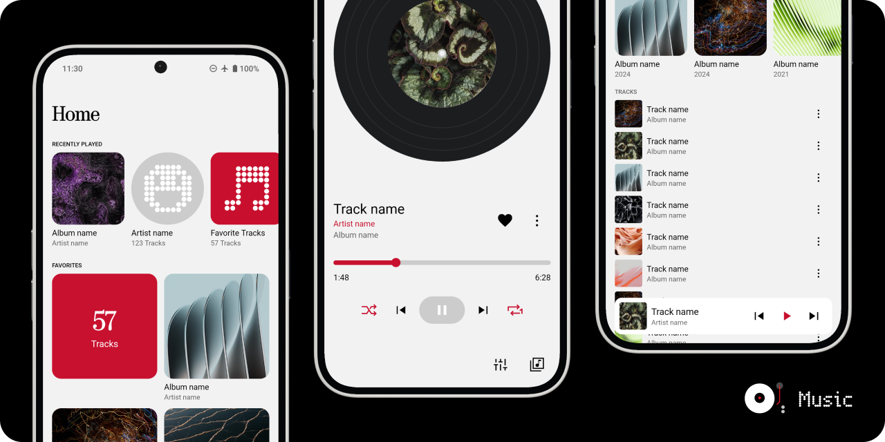

# 👋 Hi there, I'm **Tariq Said**

**Co‑Founder & Senior Full‑Stack Developer at DXBMark** · **AV/IT Executive & Event Tech Planner** · **Certified AI Prompt Engineer** · **Crestron & Extron Certified AV Technician**

**Honorary Partner** at [Mowheba Advertising](https://www.mwheba.com/) & [Mowheba Hosting](https://mwheba.net/)  

I craft human‑centred digital experiences that bridge **software development**, **audio‑visual integration** and **live event technology**. As Co‑Founder of **DXBMark** and an **Extron‑certified AV Associate**, I draw on more than **15 years' expertise** in IT support & infrastructure planning, AV integration, dynamic WordPress and full‑stack web development, DevOps, and live event technology:contentReference[oaicite:0]{index=0}. I build platforms that scale, connect and inspire, and I've managed conferences, webinars and live broadcasts across the UAE and beyond. Collaborating with partners worldwide, I deliver seamless web and mobile solutions, media streaming services and sophisticated AV systems tailored to modern business needs.

---

## 🔧 Tech Stack & Skills

#### Backend
  

#### Frontend
   

#### Languages
    

#### Databases & Storage
    

#### Real‑Time & Communication
  

#### Payment & E‑Commerce
  

#### Tools & DevOps
        

#### Mobile Development
 

#### IT & Systems
        

---

## 💡 Professional Projects & Contributions

### 🛠 Programming & Open‑Source
- **[MissingCore Music Bot](https://github.com/MissingCore-Bot/Music)** – Contributed Arabic localisation to this music streaming bot for Discord. 
  
- **[Montera Digital Signage](https://github.com/tariqsaidofficial/montera-signage)** – Architect and developer of a smart cloud signage platform that turns any screen into a dynamic content display.
- **[NFC Manager](https://github.com/tariqsaidofficial/nfcManager)** – Designed an Android app inspired by Nothing OS to manage NFC tags securely, prioritising privacy and security monitoring. 
   
  
  
  
  

### 🌐 Web Development
- **[DXBMark](https://dxbmark.com)** – Built and maintain the official company website and a suite of web tools at [tools.dxbmark.com](https://tools.dxbmark.com) delivering online utilities.
- **[Media Server as‑a‑Service](https://media.dxbmark.com)** – Developed a scalable streaming platform for hosting and serving media content, akin to a self‑hosted Netflix.
- **[Northern Estates](https://northernestates.ae)** – Co‑founder and developer of a leading real‑estate platform in Dubai. *(Logo/screenshot pending)*

### 🎤 Conferences & Events
With over four years directing live events and conferences, I specialise in technical planning and real‑time execution for medical congresses and scientific gatherings:
- **Mediterranean Minimally Invasive Surgery (MMISU)** – [mmisu.org](https://mmisu.org)
- **Egyptian Congress of Pediatric Pulmonology (ECPP)** – [egyptiancpp.org](https://egyptiancpp.org/)
- **Grand Clinical Round Conference (GCR)** – series of in‑hospital clinical rounds for medical professionals.
- **The Egyptian Association for Health Economics (EAHE)** – [eahe.xyz](https://eahe.xyz/)

---

## 📊 GitHub Stats

  
   
  
   
  

---

## 📌 Current Focus

### Travelify – Comprehensive Travel Platform
An integrated mobile application that combines travel services (hotel booking), e‑commerce, and digital services in one platform.

[Repository](https://github.com/tariqsaidofficial/travelify)

## ⭐ Pinned Repositories
📌 **Coming soon.** I'll be pinning select repositories here to showcase recent work once they are ready for public release.

---

## 🤝 Let's Connect
| Platform | Link |
|---|---|
|  | Connect on LinkedIn |
|  | Support my work |
|  | View my profile |

---

*From Tariq Said – let's build something amazing together!*
