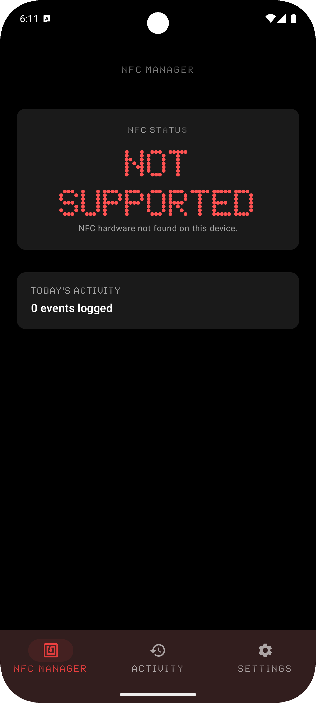

# 👋 Hi there, I'm **Tariq Said**

**Co‑Founder & Senior Full‑Stack Developer at DXBMark** · **AV/IT Executive & Event Tech Planner** · **Certified AI Prompt Engineer** · **Crestron & Extron Certified AV Technician**

**Honorary Partner** at [MWHEBA Advertising](https://www.mwheba.com/) & [MWHEBA Hosting](https://mwheba.net/)  
 

I craft human‑centred digital experiences that bridge **software development**, **audio‑visual integration** and **live event technology**. As Co‑Founder of **DXBMark** and an **Extron‑certified AV Associate**, I have more than **15 years' experience** in IT support and infrastructure planning, AV integration, WordPress and full‑stack web development, DevOps, and live event technology. I build platforms that scale, connect and inspire, and I've managed conferences, webinars and live broadcasts across the Egypt,UAE and beyond. Collaborating with partners worldwide, I deliver seamless web and mobile solutions, media streaming services and sophisticated AV systems tailored to modern business needs.

---

## 📶 Service Status & Uptime

Monitor the health and availability of the key services I operate. These badges update automatically to reflect whether the service is online or offline and display the uptime over the last 30 days.

| Service | Status | Uptime (30 d) |
| --- | --- | --- |
| **DXBMark** |  |  |
| **Northern Estates** |  |  |
| **MWHEBA** |  |  |

---

## 📋 Timeline & Experience

**2017 – 2025: Full Career Progression Across Multiple Domains**

- **2017–2020:** IT Support Specialist & Infrastructure Technician (15+ years foundation)
- **2020–2023:** Full-Stack Developer & Web Application Architect
- **2023–2024:** Event Tech Director & Conference Operations Lead
- **2024–2025:** Co-Founder at DXBMark, Senior Full-Stack Developer, AV Integration Executive

**Key Expertise Areas:** Web Development (Full-Stack), DevOps & Infrastructure, Audio-Visual Integration, Event Technology, Mobile Development, Real-time Systems

---

## 🏆 Certifications & Credentials

| Certification | Issuer | Status |
|---|---|---|
| **Certified AI Prompt Engineer** | Professional Certification | ✅ Active |
| **Extron Certified AV Associate** | Extron Electronics | ✅ Active |
| **Crestron Certified Technician** | Crestron Electronics | ✅ Active |

---

## 🔧 Tech Stack & Skills

#### Backend  
  

#### Frontend  
   

#### Languages  
    

#### Databases & Storage  
    

#### Real‑Time & Communication  
  

#### Payment & E‑Commerce  
  

#### Tools & DevOps  
        

#### Mobile Development  
 

#### IT & Systems  
        

---

## 💡 Professional Projects & Contributions

### 🛠 Programming & Open‑Source

**[MissingCore Music Bot](https://github.com/MissingCore-Bot/Music)** – Contributed Arabic localisation to this music streaming bot for Discord.

**[Montera Digital Signage](https://github.com/tariqsaidofficial/montera-signage)** – Architect and developer of a smart cloud signage platform that turns any screen into a dynamic content display.

**[NFC Manager](https://github.com/tariqsaidofficial/nfcManager)** – Designed an Android app inspired by Nothing OS to manage NFC tags securely, prioritising privacy and security monitoring.

  
  
  
  

---

### 🌐 Web Development

**[DXBMark](https://dxbmark.com)** – Built and maintain the official company website and a suite of web tools at [tools.dxbmark.com](https://tools.dxbmark.com) delivering online utilities.  
📊 **Impact:** 3K+ users | 98.7% uptime

**[Media Server as‑a‑Service](https://media.dxbmark.com)** – Developed a scalable streaming platform for hosting and serving media content, akin to a self‑hosted Netflix.  
📊 **Impact:** 500+ concurrent streams | 99.2% uptime

**[Northern Estates](https://northernestates.ae)** – Co‑founder and developer of a leading real‑estate platform in Dubai,UAE.  
📊 **Impact:** 10K+ active users | 500+ properties | 99.1% uptime

---

### 🎤 Conferences & Events

With over 4 years directing live events and conferences, I specialise in technical planning and real‑time execution for medical congresses and scientific gatherings:

- **[Mediterranean Minimally Invasive Surgery (MMISU)](https://mmisu.org)** – 500+ attendees | 15+ live sessions
- **[Egyptian Congress of Pediatric Pulmonology (ECPP)](https://egyptiancpp.org/)** – 300+ participants | International reach
- **Grand Clinical Round Conference (GCR)** – Series of in‑hospital clinical rounds for medical professionals | 50+ events
- **[The Egyptian Association for Health Economics (EAHE)](https://eahe.xyz/)** – Ongoing partnership

---

## 📊 GitHub Stats & Activity

<table align="center">
<tr>
<td align="center" width="50%">

</td>
<td align="center" width="50%">

</td>
</tr>
</table>

---

## 📌 Current Focus

### Travelify – Comprehensive Travel Platform

An integrated mobile application that combines travel services (hotel booking), e‑commerce, and digital services in one platform.

**Tech Stack:** React Native, Node.js, PostgreSQL, Stripe Integration  
**Repository:** [github.com/tariqsaidofficial/travelify](https://github.com/tariqsaidofficial/travelify)

---

## 📂 Case Studies

**Coming Soon – Deep dive into real-world projects, metrics, and impact assessments**

---

## ⭐ Featured Repositories

📌 **Coming soon.** I'll be pinning select repositories here to showcase recent work once they are ready for public release.

---

*From Tariq Said – let's build something amazing together!* 🚀

## 🤝 Let's Connect
| Platform | Contact |
|---|---|
|  | Connect on LinkedIn |
|  | info@dxbmark.com |
|  | +971 50 512 1583 |
|  | Support my work |

---

*From Tariq Said – let's build something amazing together!* 🚀
